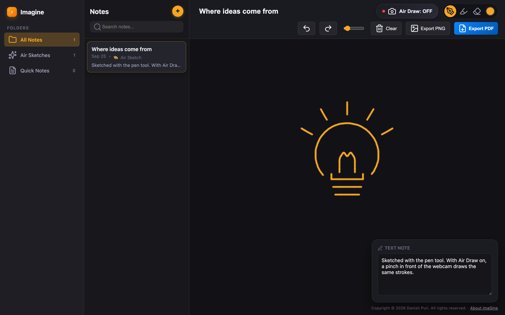
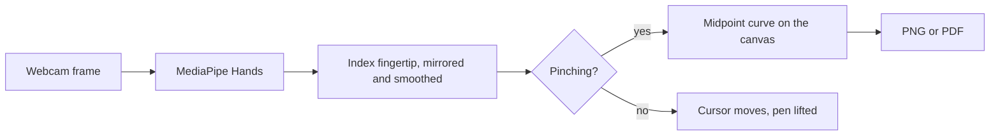
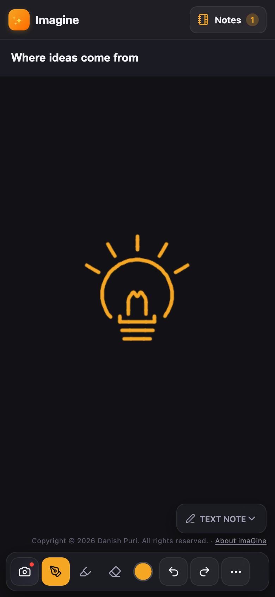

# imaGine

Draw in the air with your finger, then save the sketch as a PNG or PDF.

[](https://github.com/danish-puri/imaGine/actions/workflows/tests.yml)
[](LICENSE)

**[Try the live demo](https://danish-puri.github.io/imaGine/)** · [Read the story behind it](https://danish-puri.github.io/imaGine/about.html)



I built imaGine for the moments when an idea is easier to draw than to type and there's no pen or whiteboard nearby. A webcam follows your index finger, a pinch puts the pen down, and the stroke lands on a canvas in the browser. The same canvas also takes a mouse or a touch screen, so the app still works without a camera.

## What it does

- Draw with a webcam-tracked fingertip, a mouse, or touch
- Switch between pen, highlighter, and eraser, and choose the color and brush size
- Undo and redo through the last 25 versions of the canvas
- Type a note next to the drawing
- Keep many notes, search them, and find them again after closing the tab
- Export the drawing as a PNG, or as an A4 PDF with the title, date, drawing, and note

## Air Draw

1. Select **Air Draw** in the toolbar and allow camera access.
2. Point with your index finger to move the cursor.
3. Pinch your thumb and index finger together to draw.
4. Open the pinch to lift the pen.

A small camera preview shows the tracked hand and the frame rate. Turning Air Draw off releases the camera.

### How it works



1. [MediaPipe Hands](https://github.com/google-ai-edge/mediapipe/blob/master/docs/solutions/hands.md) looks for one hand in each 320×240 webcam frame and returns 21 landmarks.
2. The index fingertip (landmark 8) is flipped horizontally, so the cursor moves like a mirror image, and scaled to the canvas.
3. Raw landmarks jitter from frame to frame, so the cursor follows an exponential moving average, `smooth = smooth + 0.35 * (raw - smooth)`. A larger factor reacts faster, a smaller one is steadier, and 0.35 balances the two.
4. The pen goes down when the 3D distance between the thumb tip (landmark 4) and the index fingertip drops below 0.07 in MediaPipe's normalized units. It lifts when the distance grows past that.
5. Each new point joins the stroke with a quadratic curve that runs from midpoint to midpoint and bends through the sampled point. Strokes stay smooth and unbroken even when the hand travels far between frames.

Mouse and touch input skip the first four steps and share the same curve drawing.

## On a phone

On small screens the tools sit in a dock at the bottom, the note list opens from the **Notes** button, and the typed note folds into a small tab until you need it. Export lives in the **⋯** menu.

<p align="center">
  
</p>

## Run it locally

imaGine is plain HTML, CSS, and JavaScript with no build step, so any static server works.

```bash
git clone https://github.com/danish-puri/imaGine.git
cd imaGine
python3 -m http.server 8000
```

Then open http://localhost:8000. Browsers only allow the camera on secure pages, and `localhost` counts as one. MediaPipe, jsPDF, and the icons load from public CDNs at pinned versions, so the first visit needs an internet connection.

## Tests

I test the app with Playwright. The suite checks drawing, stroke continuity, undo and redo, saving and reopening notes, PNG export, that Air Draw releases the camera, and that no control slides off screen at phone, tablet, laptop, and desktop widths. GitHub Actions runs it on every push.

```bash
npm install
npx playwright install chromium
npm test               # all tests
npm run test:mobile    # phone layouts and touch input
npm run test:desktop   # tablet, laptop, and desktop layouts
```

The tests block every CDN request, so they don't depend on the network.

## Project structure

```
index.html              App layout and library scripts
styles.css              Styles for phone, tablet, and desktop
app.js                  Drawing engine, hand tracking, notes, and export
about.html, about.css   The story behind the project
tests/                  Playwright tests for mobile and desktop
docs/                   Screenshots for this README
.github/workflows/      Runs the tests on every push
```

## Privacy

Hand tracking runs entirely in the browser. Camera frames never leave the device, and there is no backend. Notes stay in the browser's local storage until you export them, and clearing the site's data deletes them.

## Limitations

- Air Draw follows one hand and works best in even light with the whole hand in view.
- The pinch threshold is a fixed distance in image coordinates. A hand far from the camera can trigger it too easily, and a hand very close has to pinch tighter.
- Notes live in one browser on one device.

## What's next

I want to turn imaGine into a hands-free classroom tool, where a teacher can move through slides, draw on them in the air, and export the marked-up lesson.

## Built with

- JavaScript, HTML5 Canvas, and CSS, with no framework
- [MediaPipe Hands](https://github.com/google-ai-edge/mediapipe/blob/master/docs/solutions/hands.md) for hand tracking
- [jsPDF](https://github.com/parallax/jsPDF) for PDF export
- [Lucide](https://lucide.dev) for icons
- [Playwright](https://playwright.dev) for tests

## License

MIT. See [LICENSE](LICENSE).

---

Created by Danish Puri.
